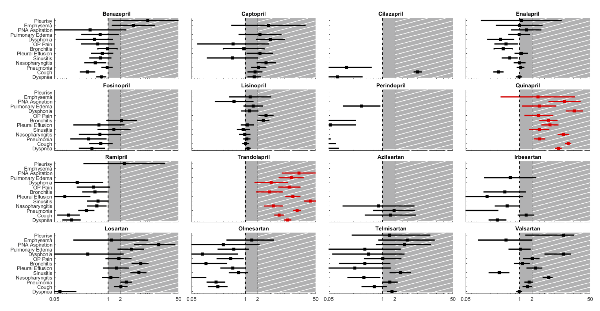
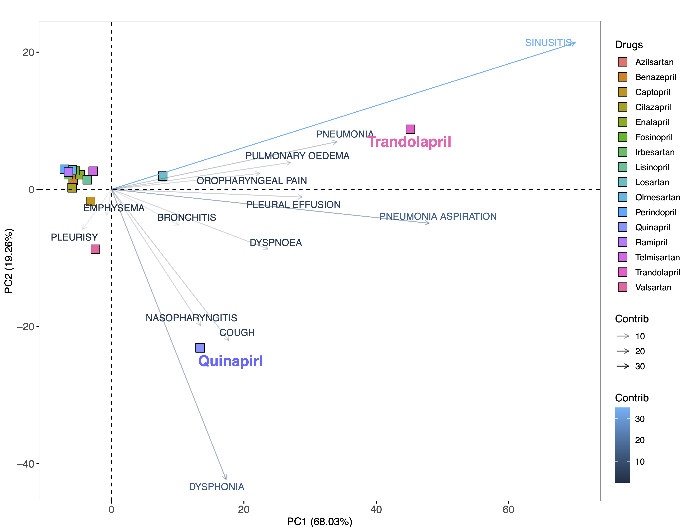

# 🏁 An Academic Portfolio 🏁
# COVID RELATED PROJECTS
## 📝 eLife
### [Data-driven methodology for discovery and response to pulmonary symptomology in hypertension through statistical learning and data mining: Application to COVID-19 related pharmacovigilance](https://elifesciences.org/articles/70734) 
* Application of quantitative methods in pharmacovigilance for meta-analyses of data during randomized clinical trials.
* 134 antihypertensive drugs out of 1151 drugs were filtered and then evaluated using the Empirical Bayes Geometric Mean (EBGM) of the posterior distribution to build ADE-drug profiles with an emphasis on the pulmonary ADEs (pADE).
* 1DATA Consortium/FDA Adverse Event Reporting System (FAERS)/Medical Dictionary for Regulatory Activities (MedDRA)/Anatomical Therapeutic Chemical (ATC)
* Python/R/SAS/PostgreSQL
* Statistical Learning/GLASSO/Friedman test

  
&nbsp; &nbsp; &nbsp; &nbsp;
  

  
&nbsp; &nbsp; &nbsp; &nbsp;

<!-- 
 -->

## 📝 nature scientific reports
### [Pulmonary adverse drug event data in hypertension with implicationson COVID‐19 morbidity](https://www.nature.com/articles/s41598-021-92734-7) 
* Hypertension is a recognized comorbidity for COVID‐19. The association of antihypertensive medications with outcomes in patients with hypertension is not fully described.
* Evaluated the occurrence of pulmonary adverse drug events (ADEs) in patients with hypertension receiving ACEIs/ARBs to determine if disparities exist between individual drugs within the respective classes using data from the FDA Spontaneous Reporting Systems.
* Angiotensin‐converting enzyme 2 (ACE2)/Angiotensin II receptor blockers (ARBs)/Hypertension

  

  

## 📝 Journal of the American Pharmacists Association
### [Pharmacovigilance in patients with diabetes: A data-driven analysis identifying specific RAS antagonists with adverse pulmonary safety profiles that have implications for COVID-19 morbidity and mortality](https://www.sciencedirect.com/science/article/pii/S1544319120302612) 
* Assessed the prevalence of pulmonary adverse drug effects (ADEs) in patients with diabetes who were taking ACEI or ARBs to provide guidance as to how these medications could affect outcomes in acute respiratory illnesses such as SARS-CoV-2 infection.
* 1DATA/1DrugAssist/ACEIs/ARBs/Diabetes
